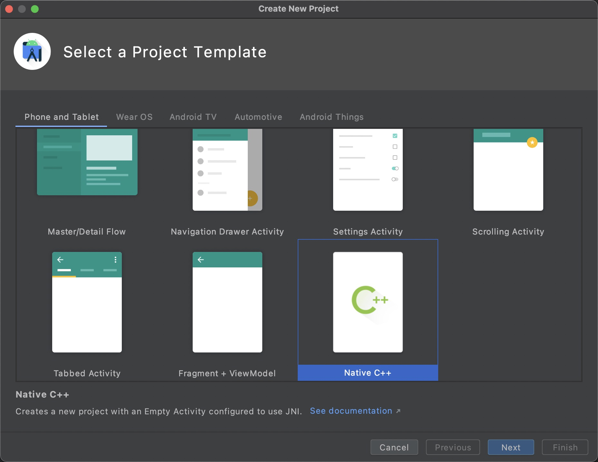

# C++工程：以 xlog 为例介绍 Android NDK 如何依赖第三方C++动态库
本文是介绍如何在NDK开发中引入xlog实现日志记录，mars团队已经把xlog打包上传到了jcenter，我们还是直接引用jcenter的xlog，通过动态引入的方式链接到xlog，实现日志功能。
##### 创建cmake native项目
我们通过Android Studio创建一个C++的项目，默认就是通过cmake管理C++代码，这里就不介绍创建过程了，那么我们就可以得到一个C++项目：




项目目录结构
```
├── app
│   ├── build.gradle
│   └── src
│       └── main
│           ├── AndroidManifest.xml
│           ├── cpp
│           │   ├── CMakeLists.txt
│           │   └── native-lib.cpp
│           ├── java/com/taoweiji/xlogexample/MainActivity.java
│           └── res
├── build.gradle
└── settings.gradle
```
> 本文是介绍cmake项目接入xlog，如果项目还是ndk-build，那么本来就不适用，需要把项目先升级到cmake才可以。

##### 修改 build.gradle

这部分的代码是要添加xlog的依赖，也增加拷贝脚本，作用是把 mars-xlog 包里面的 so文件拷贝到 src/main/jniLibs 文件夹。

```groovy
configurations {
    cmake_depends
}
dependencies {
    api "com.tencent.mars:mars-xlog:1.2.5"
    cmake_depends "com.tencent.mars:mars-xlog:1.2.5"
}
// 作用是build的时候把 mars-xlog 包里面的 so文件拷贝到 src/main/jniLibs 文件夹
task resolveDependencies {
    project.configurations.each { configuration ->
        if ("cmake_depends".equalsIgnoreCase(configuration.name)) {
            def lib = configuration.resolve()[0]
            copy {
                from zipTree(lib)
                into "${project.rootDir}/${project.name}/src/main/jniLibs/"
                include "jni/**/*.so"
            }
        }
    }
}
build.dependsOn resolveDependencies
```

执行build后，我们就可以看到在 src/main/jniLibs 增加了 xlog 的 so 文件，这里的so文件仅仅只是参与到编译过程，不会打包到apk，apk关联的还是mars-xlog.aar带有so文件。

```
src
└── jniLibs
    └── jni
        ├── arm64-v8a
        │   ├── libc++_shared.so
        │   └── libmarsxlog.so
        └── armeabi-v7a
            ├── libc++_shared.so
            └── libmarsxlog.so
```

> 从拷贝的文件可以看到，只包含了 arm64-v8a 和 armeabi-v7a 平台的 so文件，意味着这个项目无法在 x86 平台下运行。

##### 修改 CMakeLists.txt

这部分的代码是为了查找并链接 marsxlog 动态库

```
cmake_minimum_required(VERSION 3.10.2)
project("xlog-example")
include_directories(export_include)
add_library(native-lib SHARED native-lib.cpp)
# 设置 marsxlog 动态库的文件夹
set(XLOG_PATH ../jniLibs/jni/${ANDROID_ABI}/)
# 从 jniLibs 查找对应平台的marsxlog动态库
find_library(XLOG_LIB marsxlog PATHS ${XLOG_PATH} NO_DEFAULT_PATH NO_CMAKE_FIND_ROOT_PATH)
# 链接 marsxlog 动态库
target_link_libraries(native-lib ${XLOG_LIB})
```

##### 导入头文件

从 mars 的仓库下载 [xlog 的头文件](https://github.com/Tencent/mars/tree/master/mars/comm/xlogger)，放到 cpp/export_include/xlogger 目录下，只需要4个头文件，其它文件都不需要。

```
├── CMakeLists.txt
├── export_include
│   └── xlogger
│       ├── android_xlog.h
│       ├── preprocessor.h
│       ├── xlogger.h
│       └── xloggerbase.h
└── native-lib.cpp
```

##### 测试

修改 native-lib.cpp，添加测试代码

```c++
#include <jni.h>
#include <string>
#include "xlogger/xloggerbase.h"
#include "xlogger/xlogger.h"
#include "xlogger/android_xlog.h"

extern "C"
jstring
Java_com_taoweiji_xlogexample_MainActivity_stringFromJNI(
        JNIEnv* env,
        jobject /* this */) {
    xinfo_function();
    xdebug2(TSF "test xlog, have level filter. line:%0, func:%1", __LINE__, __FUNCTION__);
    xdebug2("test xlog, have level filter. line:%d, func:%s", __LINE__, __FUNCTION__);
    xassert2(1<0, "assert false info");
    xassert2(false);
    xassert2(true);
    xverbose2(TSF "test xlog, have level filter");
    LOGD("testxlog", "-------user define:%d--------", __LINE__);
    __android_log_print(ANDROID_LOG_INFO, "test", "123");
    __android_log_print(ANDROID_LOG_INFO, "test", "123:%d", 4);
    __android_log_write(ANDROID_LOG_INFO, "test", "123");
    __android_log_assert(1>0, "test", "%d", 3455);
    __android_log_assert(1<0, "test", "%d", 3455);
    __android_log_assert(1<0, "test", "3455dfdddddddddd");
    LOGI("test", "111111111111");
    std::string hello = "Hello from C++";
    return env->NewStringUTF(hello.c_str());
}
```

修改 MainActivity.java

```java
public class MainActivity extends AppCompatActivity {
    static {
        System.loadLibrary("native-lib");
    }
    @Override
    protected void onCreate(Bundle savedInstanceState) {
        super.onCreate(savedInstanceState);
        setContentView(R.layout.activity_main);
        initXLog(this);
        TextView tv = findViewById(R.id.sample_text);
        tv.setText(stringFromJNI());
    }
    public native String stringFromJNI();
    
    public static void initXLog(Context context) {
        String logPath = context.getFilesDir().getAbsolutePath() + "/logsample/xlog";
        Xlog xlog = new Xlog();
        Log.setLogImp(xlog);
        Log.setConsoleLogOpen(true);
        Log.appenderOpen(Xlog.LEVEL_DEBUG, Xlog.AppednerModeAsync, "", logPath, "LOGSAMPLE", 0);
    }
}
```

到这里就大功告成了，由于mars-xlog只包含了arm架构的so，所以只能真机运行，无法在x86的虚拟机上运行。
##### 源码
https://github.com/taoweiji/cpp-dependency-management-example/tree/master/xlog
